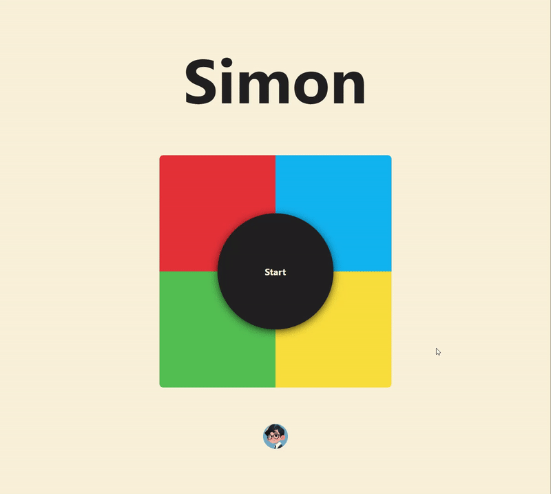

# Project: Simon-game
Project for Day 20 of Udemy 2023 Web Development Bootcamp: Simon game, a clasic yet popular memory board game, written in `HTML`+`CSS`+`Javascript`. It's simple, fully responsive, fully interactive, and fun-to-play. Click start to start the game, try to memorize the order or sounds of flashing piece, and play them out with the same order within the count down!  
[Try it out](https://jaycka.github.io/simon-game//)  
___  
**Concepts and skills used in this project:**  
`HTML` | `CSS` | `JavaScript` | `jQuery` | `DOM` | `EventListener`
___
**Features:**  
* Real-time click sound and effect
* Count down time depends on level
* Spining status bar

___  
**Demo**  

